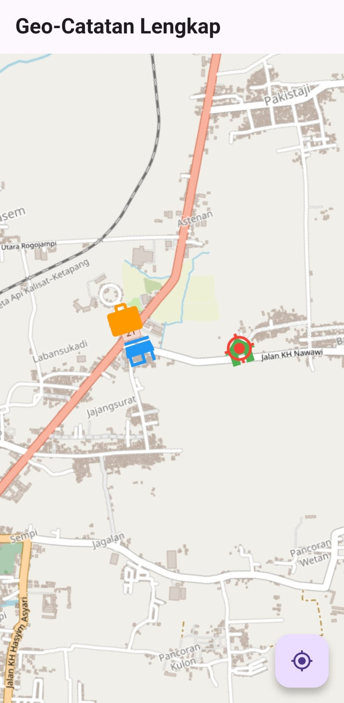

# GeoCatatan

GeoCatatan is a Flutter-based mobile application that allows users to create and manage location-based notes directly on a map. With this app, you can easily mark important places, add descriptive notes, and categorize each location by type, such as "Home," "Store," or "Office."

## Features

- **Interactive Map**: Add, view, and manage notes on an interactive map interface.
- **Location-Based Notes**: Create notes tagged to specific geographic coordinates.
- **Categorize Locations**: Assign a type (e.g., "Home," "Store," "Office") to each note for easy identification.
- **Current Location**: Quickly find and display your current location on the map.
- **Persistent Storage**: Notes are saved locally and reloaded when the app starts.
- **Simple and Intuitive UI**: A clean and user-friendly interface for a seamless experience.

## Getting Started

### Prerequisites

- Flutter SDK
- An editor like VS Code or Android Studio

### Installation

1. **Clone the repository:**
   ```sh
   git clone https://github.com/your-username/geocatatan.git
   cd geocatatan
   ```

2. **Install dependencies:**
   ```sh
   flutter pub get
   ```

3. **Run the app:**
   ```sh
   flutter run
   ```

## Usage

- **Add a New Note**: Long-press on the map to add a new note. Enter the location details and category.
- **View Notes**: Tap on a note to view its details.
- **Manage Notes**: Swipe left or right on a note to delete it.

## Contributing

Contributions are welcome! Please fork the repository and submit a pull request with your changes.

## Tampilan Aplikasi
